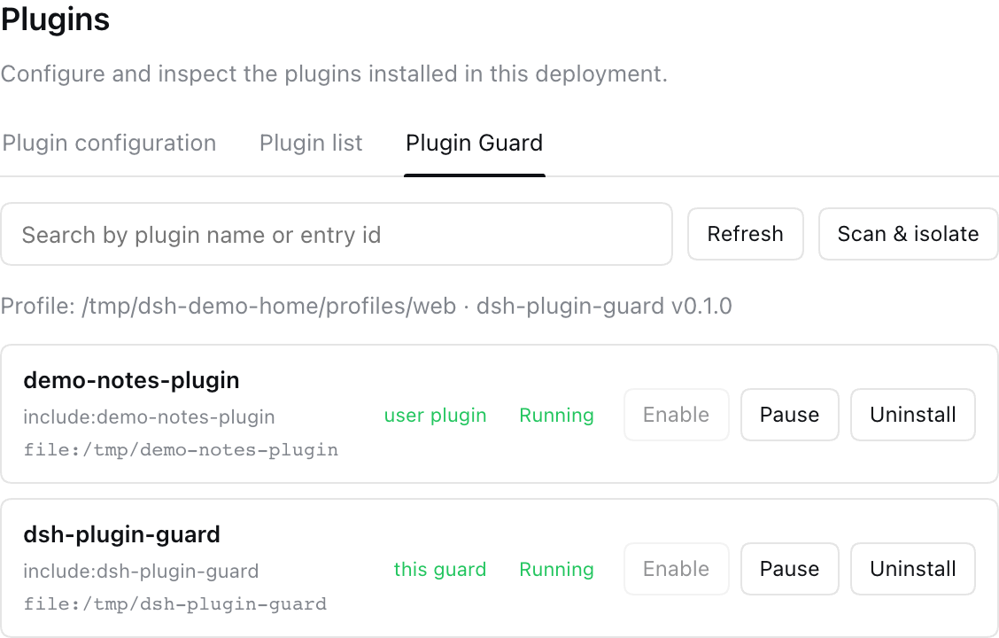
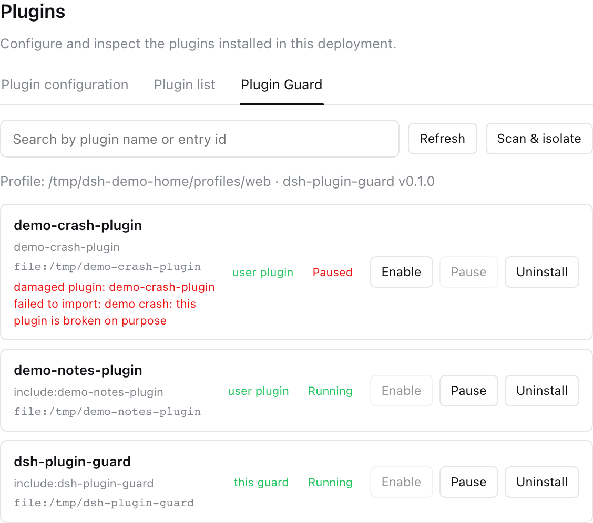

**English** | [中文](docs/README.zh-CN.md)

# dsh-plugin-guard

**A safety-guard plugin for DeepSeek Harness (DSH) — a broken plugin can never take your web UI down.**

_Plugin health scan · Damage isolation · Enable / disable / uninstall · One-click self-update from npm_

[](https://www.npmjs.com/package/dsh-plugin-guard)
[](https://github.com/wuwei6666/dsh-pluginGuard/actions/workflows/ci.yml)
[](LICENSE)

[What is it](#what-is-it) · [Why it cannot crash](#why-it-cannot-crash) · [Features](#features) · [Install](#install) · [Update](#update) · [Standalone guard](#standalone-guard-script) · [FAQ](#faq) · [License](#license)
## What is it

`dsh-plugin-guard` is a plugin for **DeepSeek Harness (DSH)** that adds a **Plugin Guard** tab under **Settings → Plugins**. It watches over the plugins you install into your user profile: list them, enable / pause / uninstall them, scan them for damage, and — most importantly — **isolate any plugin that would otherwise crash the whole web client on startup**.

It also keeps itself healthy: the tab checks npm for a newer version of `dsh-plugin-guard` and shows a one-click **update** button when one is available.

| Everyday state | A broken plugin, isolated |
| --- | --- |
|  |  |

Right: `demo-crash-plugin` throws on import — without the guard it takes the whole web client down at boot; with the guard it is quarantined and shown as **damaged**, while everything else keeps running.

## Why it cannot crash

| Guarantee | How |
| --- | --- |
| **Other plugins won't crash the web UI** | The guard imports every user plugin entry in isolation; anything that throws is removed from the boot bundles, disabled via `cordis.patch.yml`, and recorded in `dsh-plugin-guard-damage.json` as "damaged plugin" instead of breaking startup. |
| **The guard itself never crashes** | Every server entry point and every UI render is wrapped in failure isolation (route `try/catch`, React error boundary, guarded module loading). At worst, the guard's own tab is unavailable — the rest of the web client is untouched. |
| **DSH upgrades won't break it** | The plugin imports **zero** DSH runtime packages. It only uses Node.js built-ins and defensively probes the loader / slots APIs, so a DSH upgrade degrades it gracefully instead of crashing it. |

## Features

- **Plugin Guard tab** in Settings → Plugins: lists only the plugins you installed yourself (built-in/runtime plugins are never shown or touched).
- **Scan & isolate**: one click re-validates every user plugin and quarantines the broken ones.
- **Enable / pause / uninstall** user plugins, persisted across restarts through the profile's `cordis.patch.yml`.
- **Bilingual UI (English / 中文)** that follows the DSH language setting automatically.
- **Self-update check**: compares the running version with npm; shows an **Update now** button when a newer release exists and installs it in place (restart the web client to finish).
- **Standalone guard script** (`lib/profile-guard.js`) that can repair a profile *before* the web client even starts.

All writes are confined to the user profile directory: `DSH_HOME` (or `dsh_home`) when set, otherwise `~/.dsh/profiles/web` (same layout on macOS, Linux, and Windows). The application install directory is never modified.

## Install

With the DSH CLI:

```bash
dsh plugin --profile web add dsh-plugin-guard
```

Or edit `<dsh-home>/profiles/web/package.json` by hand:

```json
{
  "dependencies": {
    "dsh-plugin-guard": "^0.1.0"
  },
  "dsh": {
    "profile": {
      "bundles": ["dsh-plugin-guard"]
    }
  }
}
```

then run `pnpm install` (or `npm install`) in that profile directory and restart the DSH web client.

> `<dsh-home>` resolves to `$DSH_HOME`, then `$dsh_home`, then `~/.dsh`.

## Update

Open **Settings → Plugins → Plugin Guard**. The guard checks npm automatically; when a newer version exists, an update banner appears — click **Update now** and restart the web client. The registry used is your configured npm registry (`npm config get registry`, `.npmrc`, or `npm_config_registry`), falling back to `https://registry.npmjs.org/`.

You can also update manually:

```bash
dsh plugin --profile web add dsh-plugin-guard@latest
```

## Standalone guard script

If a broken plugin already prevents the web client from starting, run the guard script directly — it isolates damaged plugins before the next boot:

```bash
node <dsh-home>/profiles/web/node_modules/dsh-plugin-guard/lib/profile-guard.js
# or with a custom home:
DSH_HOME=/path/to/.dsh node profile-guard.js
```

## FAQ

**Does it modify DSH itself?**
No. It only maintains the user profile (`package.json`, `cordis.patch.yml`, `dsh-plugin-guard-damage.json`) and never touches the application install directory.

**Does it send data anywhere?**
The only network request is a read-only version check against your npm registry for `dsh-plugin-guard` itself. No telemetry, no uploads.

**Can the guard disable or uninstall itself?**
Yes — it behaves like any other plugin. Disabling or uninstalling it takes effect after a restart, and the Plugin Guard tab simply disappears.

**What if the guard tab itself breaks?**
Then only that tab is blank. The host settings page, other plugins, and the web client keep working.

## License

[MIT](LICENSE)
