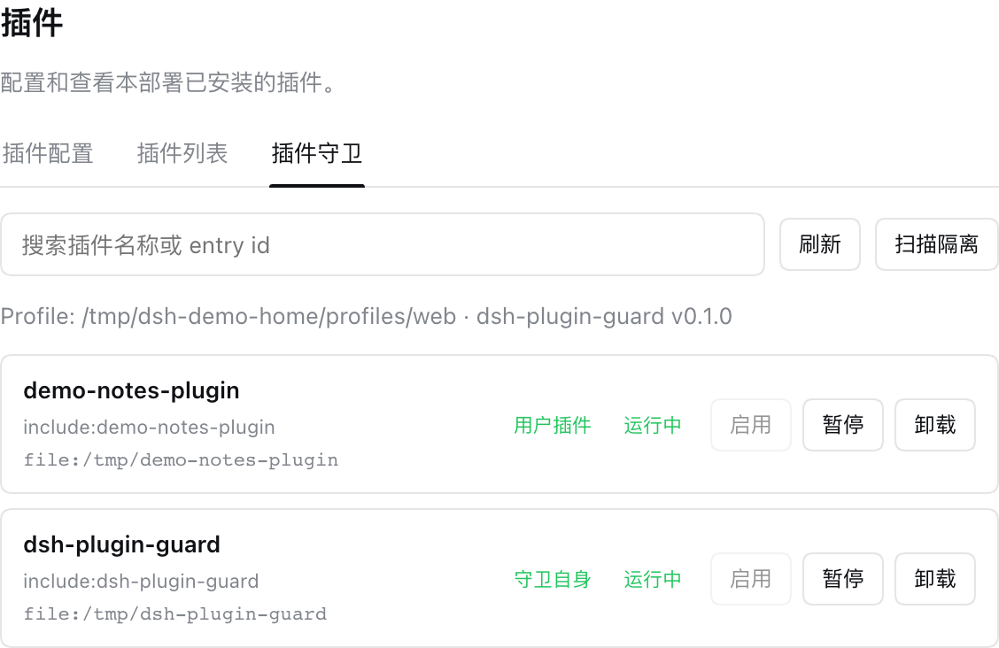
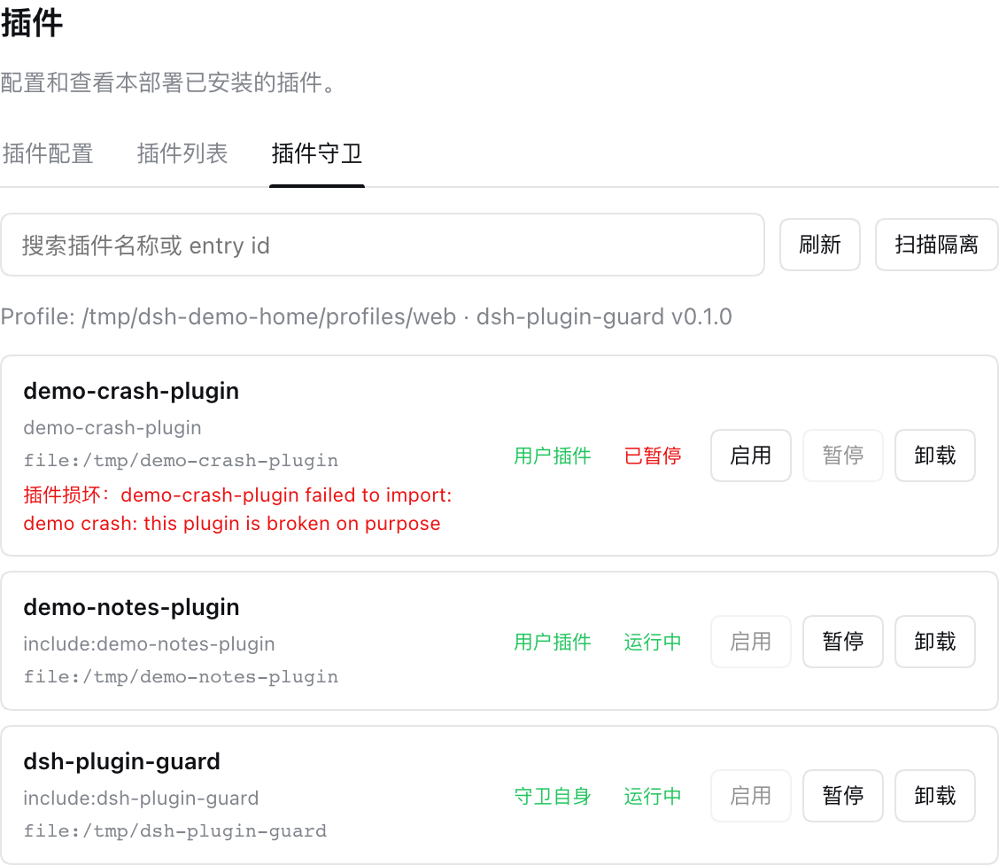

[English](README.md) | **中文**

# dsh-plugin-guard

**DeepSeek Harness（DSH）的插件守卫 —— 任何损坏的插件都无法拖垮你的 web 界面。**

_插件健康扫描 · 损坏隔离 · 启用 / 暂停 / 卸载 · npm 一键自更新_

[](https://www.npmjs.com/package/dsh-plugin-guard)
[](https://github.com/wuwei6666/dsh-pluginGuard/actions/workflows/ci.yml)
[](LICENSE)

[是什么](#是什么) · [为什么不会崩](#为什么不会崩) · [功能](#功能) · [安装](#安装) · [更新](#更新) · [独立守卫脚本](#独立守卫脚本) · [常见问题](#常见问题) · [许可证](#许可证)

## 是什么

`dsh-plugin-guard` 是一个 **DeepSeek Harness（DSH）** 插件，在 **Settings → Plugins** 下提供 **Plugin Guard** 页面。它守护你安装到用户 profile 里的插件：列出、启用 / 暂停 / 卸载、扫描损坏，并且最重要的是——**把会导致整个 web 端启动崩溃的插件隔离掉**。

它也会照顾好自己：页面会自动检查 npm 上是否有 `dsh-plugin-guard` 的新版本，有的话直接显示**一键更新**按钮。

| 正常运行 | 损坏插件被隔离 |
| --- | --- |
|  |  |

右图：`demo-crash-plugin` 导入即抛错——没有守卫时它会让整个 web 端启动崩溃；有守卫时它被隔离并标记为 **damaged**，其它插件照常运行。

## 为什么不会崩

| 保证 | 实现方式 |
| --- | --- |
| **别的插件不拖垮 web 端** | 守卫会逐个导入校验用户插件入口；导入失败的插件会被移出启动 bundles、通过 `cordis.patch.yml` 禁用，并写入 `dsh-plugin-guard-damage.json` 标记为「damaged plugin」，而不是让启动崩溃。 |
| **守卫自身绝对不崩** | 服务端每个入口、界面每次渲染都有故障隔离（路由 `try/catch`、React Error Boundary、受保护的模块加载）。最坏情况只是守卫自己的页面不可用，web 端其它部分不受影响。 |
| **dsh 升级也扛得住** | 本插件**不 import 任何 dsh 运行时包**，只使用 Node.js 内置模块，并对 loader / slots 等宿主 API 做防御式探测。dsh 升级后最多优雅降级，不会崩溃。 |

## 功能

- **Plugin Guard 页面**（Settings → Plugins）：只展示你自己安装的插件，内置/运行时插件不展示也不触碰。
- **Scan & isolate（扫描隔离）**：一键重新校验所有用户插件，把损坏的隔离出局。
- **启用 / 暂停 / 卸载**用户插件，通过 profile 的 `cordis.patch.yml` 持久化，重启后依然生效。
- **中英双语界面**：自动跟随 dsh 的语言设置。
- **版本自查**：对比运行版本与 npm 最新版本；有新版本时显示 **Update now** 按钮，原地安装（重启 web 端后生效）。
- **独立守卫脚本**（`lib/profile-guard.js`）：web 端启动之前就能修复 profile。

所有写入都只发生在用户 profile 目录：优先 `DSH_HOME`（兼容 `dsh_home`），否则 `~/.dsh/profiles/web`（macOS、Linux、Windows 布局一致）。应用安装目录绝不被修改。

## 安装

使用 dsh CLI：

```bash
dsh plugin --profile web add dsh-plugin-guard
```

或者手动编辑 `<dsh-home>/profiles/web/package.json`：

```json
{
  "dependencies": {
    "dsh-plugin-guard": "^0.1.0"
  },
  "dsh": {
    "profile": {
      "bundles": ["dsh-plugin-guard"]
    }
  }
}
```

然后在该 profile 目录运行 `pnpm install`（或 `npm install`），重启 dsh web 端。

> `<dsh-home>` 依次解析为 `$DSH_HOME`、`$dsh_home`、`~/.dsh`。

## 更新

打开 **Settings → Plugins → Plugin Guard**。守卫会自动检查 npm；发现新版本时会出现更新横幅，点击 **Update now**，然后重启 web 端即可。检查与安装使用的 npm 源是你本机配置的 registry（`npm config get registry`、`.npmrc` 或 `npm_config_registry`），未配置时回退到 `https://registry.npmjs.org/`。

也可以手动更新：

```bash
dsh plugin --profile web add dsh-plugin-guard@latest
```

## 独立守卫脚本

如果某个损坏插件已经让 web 端起不来，可以直接运行守卫脚本，在下一次启动前完成隔离：

```bash
node <dsh-home>/profiles/web/node_modules/dsh-plugin-guard/lib/profile-guard.js
# 自定义 home 时：
DSH_HOME=/path/to/.dsh node profile-guard.js
```

## 常见问题

**它会修改 dsh 本体吗？**
不会。它只维护用户 profile（`package.json`、`cordis.patch.yml`、`dsh-plugin-guard-damage.json`），绝不触碰应用安装目录。

**它会向外发数据吗？**
唯一的网络请求是向你的 npm registry 查询 `dsh-plugin-guard` 自身的最新版本号。没有遥测，没有上传。

**守卫能停用或卸载自己吗？**
可以——它和其它插件行为一致。停用或卸载在重启后生效，Plugin Guard 页面随之消失。

**如果守卫页面自己坏了呢？**
最多只有这个页面空白。宿主设置页、其它插件和整个 web 端照常工作。

## 许可证

[MIT](LICENSE)
